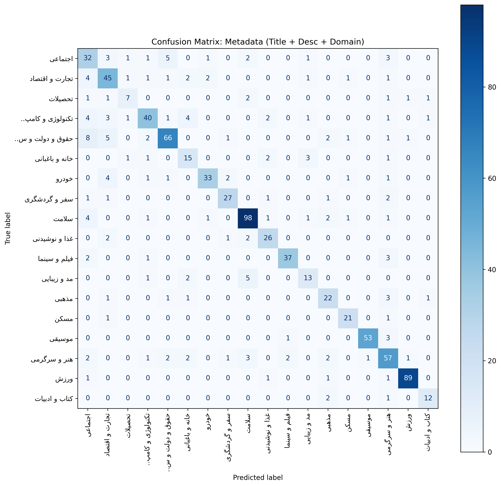

# Persian News Category Classifier 🚀

  

**A production-ready machine learning pipeline for classifying Persian news articles using TF-IDF + LinearSVC.** Includes CLI tools, a REST API, preprocessing utilities, and deployment configuration.

---

## 📌 Table of Contents

- [Business Value & Impact](#business-value-impact)  
- [Repository Structure](#repository-structure)  
- [Usage Guide](#usage-guide)  
  - [Installation](#installation)  
  - [Verify Model](#verify-model)  
- [Command Line Usage (CLI)](#command-line-usage-cli)  
- [REST API Usage (Production Mode)](#rest-api-usage-production-mode)  
- [Model Performance](#model-performance)  
  - [Confusion Matrix](#confusion-matrix)  
- [Preprocessing Pipeline](#preprocessing-pipeline)  
- [Configuration (`src/config.py`)](#configuration-srcconfigpy)  
- [Roadmap](#roadmap)  
- [Author](#author)

---
<a name="business-value-impact"></a>
## 🎯 Business Value & Impact

This system replaces manual categorization of news articles with an automated ML pipeline optimized for speed and reliability.

| Metric              | Performance            | Business Implication                                               |
| :------------------ | :--------------------- | :----------------------------------------------------------------- |
| **Automation Rate** | **~80%**               | Only 20% of articles require manual review.                        |
| **Accuracy (F1)**   | **0.80**               | High reliability on 17 distinct content categories.                |
| **Throughput**      | **10k+ / day**         | Lightweight architecture allows massive scaling on CPU.            |
| **Risk Control**    | **Confidence Scoring** | Predictions below **65% confidence** are flagged for human review. |

---
<a name="repository-structure"></a>
## 📂 Repository Structure

The project separates experimentation (notebooks) from production logic (scripts).

```text
.
├── data/                    # Raw training data and stopwords
├── models/                  # Serialized artifacts (Pipeline + Encoders)
├── src/                     # Configuration and utility modules
│   └── config.py
├── notebooks/
│   └── test.ipynb           # Experimentation, EDA, and Model Training
├── predict.py               # CLI tool for single-instance inference
├── api.py                   # Flask REST API for production deployment
├── requirements.txt         # Project dependencies
├── figures/                 # Output images (confusion_matrix.png)
└── README.md                # Project documentation
```

---
<a name="usage-guide"></a>
## 📘 Usage Guide

<a name="installation"></a>
### 🚀 Installation

1. Clone the repository:

```bash
git https://github.com/amirhadi0210/persian-news-topic-classifier
cd persian-news-topic-classifier
```

2. Install dependencies:

```bash
pip install -r requirements.txt
```
<a name="verify-model"></a>
3. Verify that the model exists:

```text
models/persian_classifier_v1.pkl
```

If missing, run the training notebook to generate it.

---
<a name="command-line-usage-cli"></a>
## 🖥️ Command Line Usage (CLI)

Test a single prediction:

```bash
python predict.py "تیم ملی فوتبال ایران در جام جهانی عملکرد خوبی داشت"
```

Example Output:

```text
Input: تیم ملی فوتبال ایران در جام جهانی...
Prediction: ورزش
Confidence: 0.9214
```

---
<a name="rest-api-usage-production-mode"></a>
## 🌐 REST API Usage (Production Mode)

Start the API server locally:

```bash
python api.py
```

Send a request with `curl`:

```bash
curl -X POST http://localhost:5000/predict \
     -H "Content-Type: application/json" \
     -d '{"title": "نرخ تورم کاهش یافت", "description": "گزارش بانک مرکزی نشان میدهد..."}'
```

Example Response:

```json
{
  "status": "success",
  "category": "تجارت و اقتصاد",
  "confidence": 0.88,
  "model_version": "v1.2_prod"
}
```

---
<a name="model-performance"></a>
## 📊 Model Performance

The classifier uses **TF‑IDF vectorization + LinearSVC** — an efficient, interpretable choice for high‑dimensional sparse Persian text.

* **Cross-Validation F1:** 0.81 (±0.016)
* **Held-Out Test F1:** 0.80

### Confusion Matrix


---
<a name="preprocessing-pipeline"></a>
## 🔧 Preprocessing Pipeline

* Character normalization (Persian/Arabic mappings) using Parsivar
* Sentence and word tokenization
* Punctuation, digit removal and basic cleaning
* Domain-specific stopword filtering

---
<a name="configuration-srcconfigpy"></a>
## ⚙️ Configuration (`src/config.py`)

Adjustable parameters (examples):

| Parameter                  | Description                                     |
| :------------------------- | :---------------------------------------------- |
| `min_confidence_threshold` | Predictions below this threshold trigger review |
| `fallback_category`        | Category returned when confidence is too low    |
| `ngram_range`              | TF‑IDF n‑gram window, default `(1, 3)`          |

`src/config.py` provides `CONFIG` and `DEPLOYMENT_CONFIG`; prefer importing those instead of hardcoding values.

---
<a name="roadmap"></a>
## 📈 Roadmap

* [ ] Dockerize API for Kubernetes deployment
* [ ] Add Prometheus/Grafana monitoring for drift detection
* [ ] Experiment with ParsBERT/transformers for ambiguous categories

---
<a name="author"></a>
## 👤 Author

**Amirhadi Souratian**
Data Scientist / ML Engineer

---

